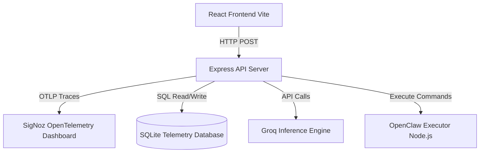
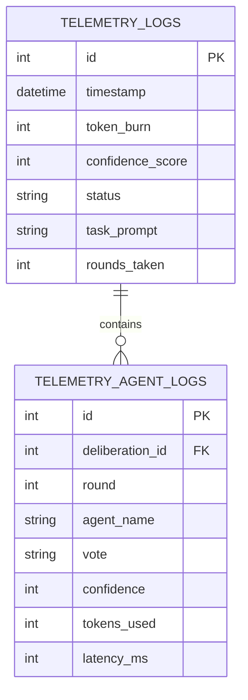

# AI Council

An agentic multi-agent consensus system built for the Agents of SigNoz Hackathon.

## Overview
AI Council allows multiple specialized AI agents (System Architect, Security Evaluator, Edge-Case Specialist) to deliberate, debate, and vote on complex tasks before presenting an approved action plan to the human. Once confirmed, an autonomous action engine executes the task.

The entire deliberation loop, token cost, consensus latency, and execution spans are fully observed using SigNoz (OpenTelemetry).

## Quick Start
1. Install dependencies:
   ```bash
   cd server && npm install
   cd ../client && npm install
   ```
2. Start the Backend Server:
   ```bash
   cd server && npm run dev
   ```
3. Start the Frontend Dashboard:
   ```bash
   cd client && npm run dev
   ```

---

# System Architecture

This document outlines the core infrastructure and execution flow of the AI Council platform.

## 1. High-Level Infrastructure

The platform is designed as a distributed, multi-tier application with built-in observability. 



### Core Components
* **Frontend Application**: A React-based IDE built with Vite. It handles user interaction, rendering the file explorer, and visualizing the real-time deliberation telemetry.
* **Backend Council Engine**: An Express.js Node server that orchestrates the multi-agent deliberation loop. It coordinates Llama-3.3-70B, Llama-3.1-8B, and Qwen-27B.
* **OpenClaw Executor**: A secure, isolated subsystem responsible for taking consensus-approved shell commands and executing them on the local filesystem.
* **Telemetry Store**: A local SQLite database that records high-frequency telemetry, agent token burn, latency, and confidence scores for historical tracking.
* **SigNoz Observability**: The OpenTelemetry auto-instrumentation SDK captures traces across the entire backend pipeline, tracking request latency, errors, and system health.

## 2. Deliberation Execution Flow

When a user submits a prompt, the system initiates a parallel debate loop. The models interact iteratively until consensus is reached or the maximum round limit is hit.

```mermaid
sequenceDiagram
    participant User
    participant Conductor
    participant Llama70B
    participant Llama8B
    participant Qwen27B
    participant Executor

    User->>Conductor: Submit task and workspace context
    loop Iterative Deliberation (Max 5 Rounds)
        Conductor->>Llama70B: Evaluate prompt
        Conductor->>Llama8B: Evaluate prompt
        Conductor->>Qwen27B: Evaluate prompt
        
        Llama70B-->>Conductor: Vote (Approve/Reject) + Command
        Llama8B-->>Conductor: Vote (Approve/Reject) + Command
        Qwen27B-->>Conductor: Vote (Approve/Reject) + Command
        
        alt Unanimous Approval
            Conductor->>Conductor: Consensus Reached
            break
        else Disagreement Detected
            Conductor->>Conductor: Compile previous debate history
        end
    end
    
    Conductor->>User: Present Highest Confidence Artifact
    User->>Executor: Authorize Execution
    Executor-->>User: Return Shell Output
```

## 3. Data Schema and Telemetry Design

The telemetry subsystem is built to provide maximum visibility into agent behavior without impacting the critical execution path.



The data architecture ensures that every agent's decision is permanently logged, enabling the dashboard to calculate the historical amend rate, approval matrices, and latency scatter plots.
